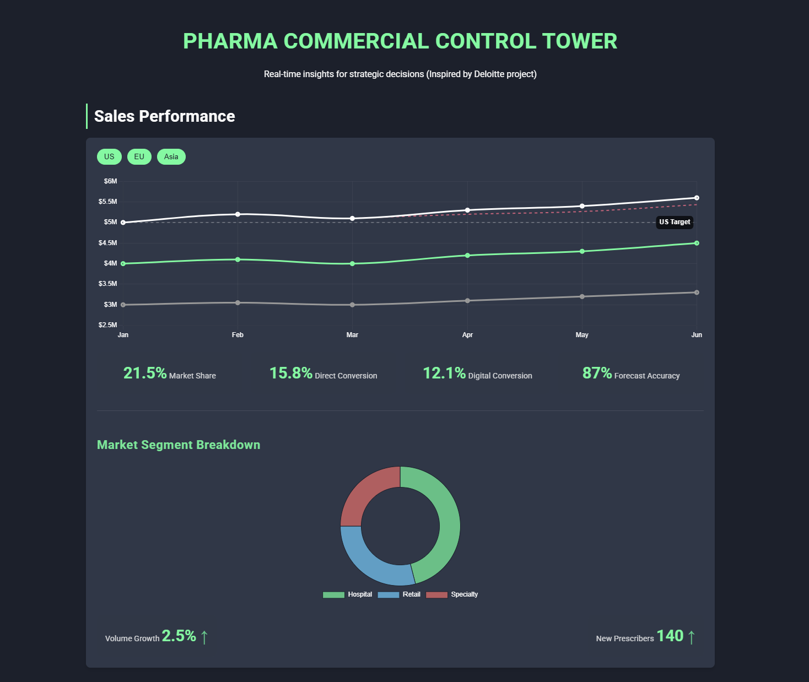
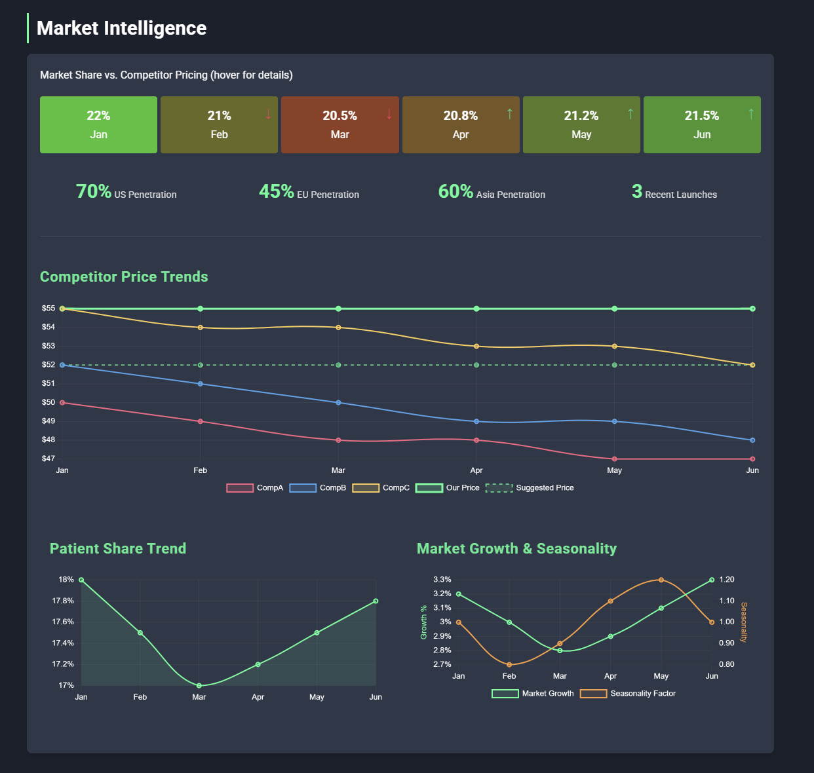
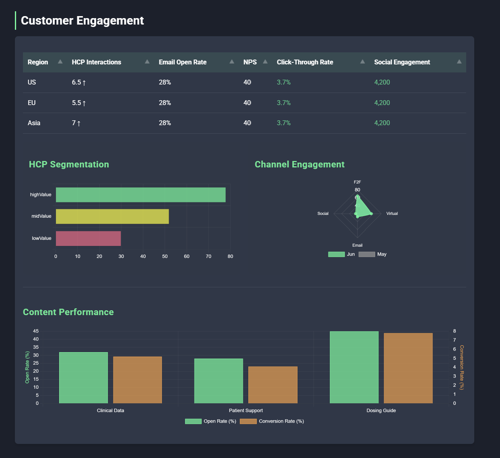
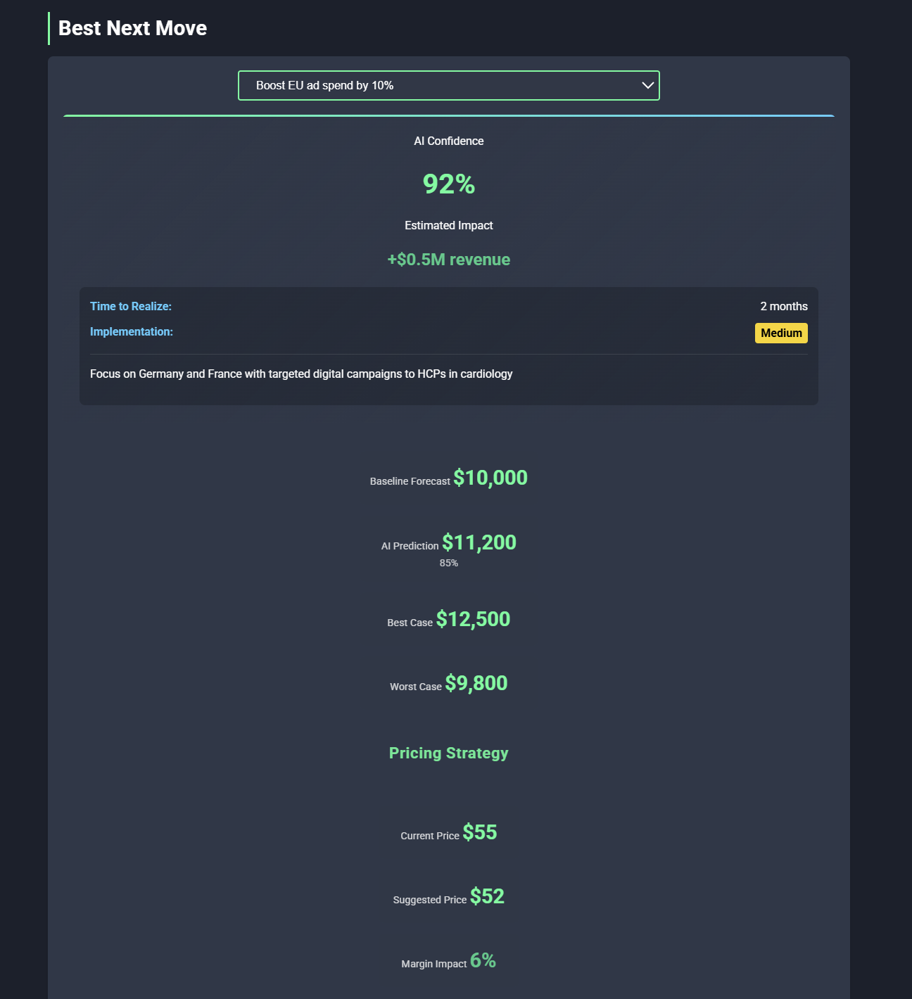
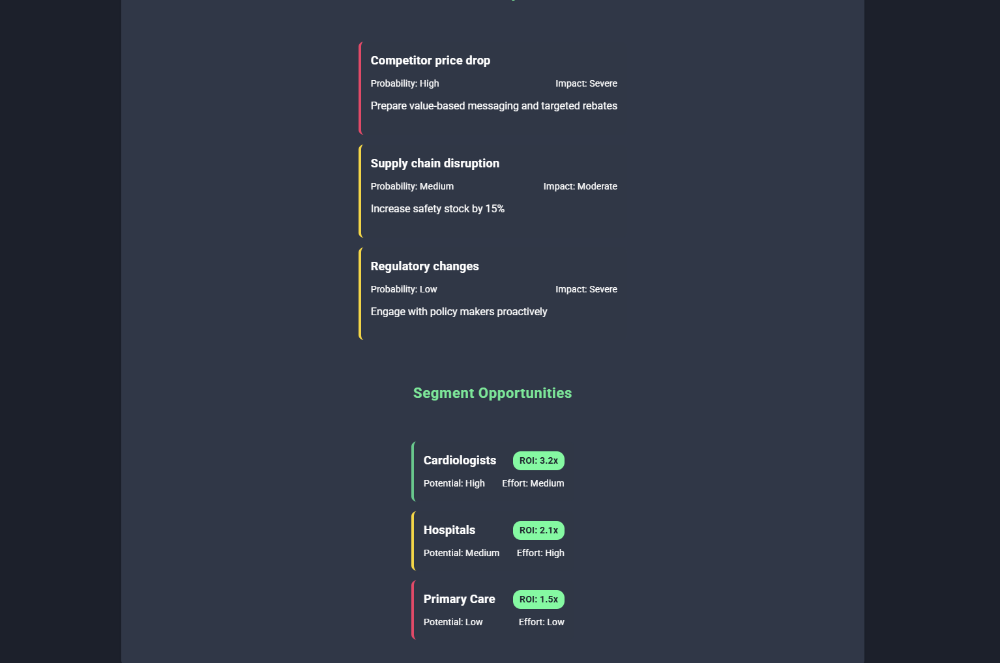
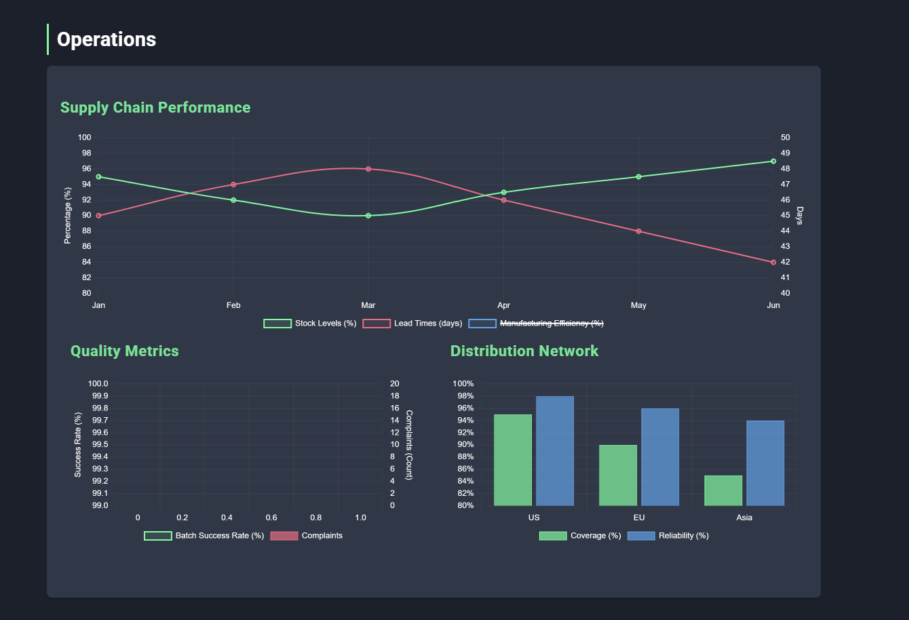

# Pharma Commercial Control Tower

Welcome to the **Pharma Commercial Control Tower** — a cutting-edge, data-driven dashboard for commercial analytics projects and infused with a sleek, dark theme with neon accents.

Built with **HTML**, **CSS**, and **JavaScript**, this tool delivers real-time insights into pharmaceutical sales, market intelligence, customer engagement, AI-driven recommendations, and operational performance — all powered by synthetic data.

### Demo
[Have a look at an example here](https://carstoneous.github.io/Pharma-Commercial-Control-Tower/)

---

## ✨ Overview

This project features a modern, interactive interface with:

- Dynamic charts powered by **Chart.js**
- AI-recommendation modules
- Smooth UX animations
- Fully responsive design for desktop, tablet, and mobile

Whether you're a pharma executive, data analyst, or tech enthusiast, this dashboard gives a glimpse into the **future of commercial strategy visualization**.

---

## 🔍 Features

### 1. Sales Performance

- **Interactive Sales Chart**  
  Toggle revenue trends across regions (US, EU, Asia) with a moving average line.

- **Market Segment Breakdown**  
  Doughnut chart highlighting hospital, retail, and specialty performance.

- **Key Metrics Dashboard**  
  Real-time KPIs for:
  - Market share
  - Conversion rates (direct & digital)
  - Forecast accuracy
  - Volume growth
  - New prescribers

---

### 2. Market Intelligence

- **Competitor Heatmap**  
  Market share vs. pricing, color-coded with interactive tooltips.

- **Price Trends**  
  Line chart comparing internal vs. competitor pricing, with overlays for recommendations.

- **Patient Share & Trends**  
  Dual-axis chart tracking patient share, market growth, and seasonal effects.

---

### 3. Customer Engagement

- **Sortable Table**  
  View HCP interaction metrics by region — email open rate, NPS, CTR, social media engagement.

- **HCP Segmentation**  
  Bar chart segmenting engagement scores by value tier (High, Mid, Low).

- **Channel & Content Effectiveness**  
  Radar and bar charts evaluating channels and content strategies.

---

### 4. AI-Driven Insights

- **Best Next Move**  
  AI-generated action suggestions with:
  - Confidence scores
  - Expected impact
  - Implementation tips

- **Pricing Strategy**  
  Simulated scenarios comparing current vs. AI-suggested prices with margin and volume effects.

- **Risk & Opportunity Cards**  
  Clear overview of:
  - Risks (likelihood, impact)
  - Opportunities (ROI, implementation effort)

---

### 5. Operations

- **Supply Chain Dashboard**  
  Track:
  - Inventory levels
  - Lead times
  - Manufacturing performance

- **Quality Metrics**  
  Combined chart for batch success rates and complaint frequency.

- **Distribution Network**  
  Regional bar charts showing logistics reach and reliability.

---

### 6. Visual & UX Highlights

- **Dark Mode with Neon Accents**  
  Inspired by futuristic SpaceX and X.com styling.

- **Smooth Animations**  
  Includes fade-ins, hover effects, and counter transitions.

- **Responsive Design**  
  Optimized for:
  - Mobile (320px+)
  - Tablet
  - Desktop (1025px+)

---

## 🛠 Tech Stack

- **HTML5** — Semantic structure  
- **CSS3** — Grid layout, dark theme, animations  
- **JavaScript (ES6)** — Dynamic interactivity  
- **Chart.js** — Interactive visualizations  
- **chartjs-plugin-annotation** — Chart overlays  
- **Synthetic JSON Data** — Embedded demo dataset  

---

## 📁 File Structure

  pharma-commercial-control-tower/ 
    ├── index.html # Main HTML entry point 
    ├── script.js # JavaScript logic and chart setup 
    ├── styles.css # CSS styling with dark theme 
    └── README.md # This documentation file

---

## 💡 Usage Tips

- **Click filters** in Sales to toggle regions
- **Sort tables** by column in Engagement
- **Use the dropdown** in AI to explore recommendations
- **Hover on charts** to reveal tooltips and detailed metrics

---

## 📸 Screenshots

> Upload screenshots in your repo and link them like this:

### 💰 Sales Performance

### 🧠 AI Recommendations

### 🌐 Operations

---

## 🔮 Future Enhancements

- Integrate **live pharma datasets** via APIs  
- Add **machine learning models** for prediction  
- Enable **PDF/CSV export** of charts and tables  
- Implement **theme switcher** (dark/light modes)  

---

## 🤝 Contributing

Contributions are welcome!  
Feel free to fork the repo, create pull requests, or open issues for:

- Enhancing features  
- Fixing bugs  
- Improving UI/UX

---

## 🧾 Credits

**Created by**: Carsten Ludwig  
**Built with**: HTML, CSS, JavaScript, Chart.js  
**Inspired by**: Deloitte Commercial Control Tower

---

## 📄 License

This project is licensed under the **MIT License**.  
Feel free to use, adapt, or share it!

> Explore the **Pharma Commercial Control Tower** — where **data meets design**, and **insights drive action**.
